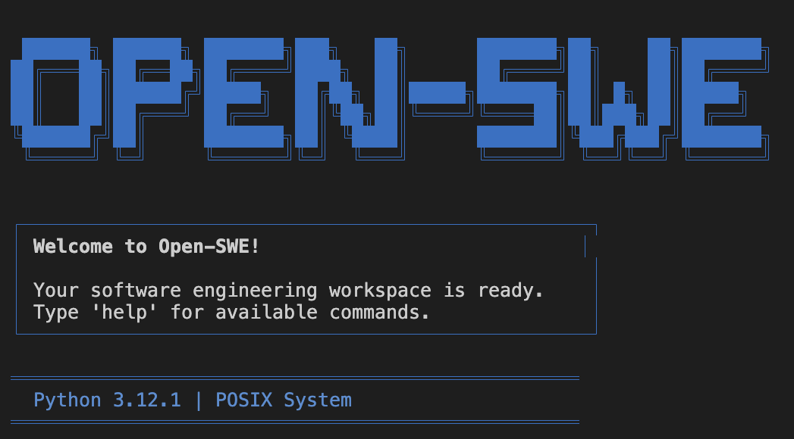

# Open-SWE Python

A Python implementation of [LangChain's Open-SWE](https://github.com/langchain-ai/open-swe) (Open Software Engineering) agent with multi-agent workflow for automated coding tasks. This system provides an intelligent software engineering assistant that can understand requirements, plan solutions, and generate code through a collaborative multi-agent approach. This repo in particular is made to help show you how to use Open-SWE as an MCP server with VS Code.For a model detail step by step walk through check out the [Lets Learn MCP Python](https://github.com/microsoft/lets-learn-mcp-python) repo! 



## Overview

Open-SWE Python is designed to automate software engineering tasks by leveraging multiple specialized AI agents that work together to deliver complete solutions. The system uses a graph-based workflow where different agents handle specific aspects of the software development process. It also uses MCP to work directly with vs code so the agent can be invoked through Github Copilot. 

## Architecture

The system consists of three main agents:

- **Manager Agent**: Orchestrates the workflow and decides which agent should handle each task
- **Planner Agent**: Analyzes requirements and creates detailed implementation plans
- **Programmer Agent**: Executes the coding tasks based on the generated plans

## Features

- Multi-agent collaborative workflow
- Intelligent task planning and execution
- Support for various programming languages and frameworks
- Rich console interface for enhanced user experience
- Extensible architecture for adding new capabilities
- Command-line interface for easy integration

## Installation

### Prerequisites

- Python 3.12 or higher, from [Python.org](https://www.python.org/)
- UV package manager (recommended) or pip
- [VS Code](https://code.visualstudio.com/) (if using as a client)

### Using UV (Recommended)

```bash
git clone https://github.com/marlenezw/open-swe-python.git
cd open-swe-python
uv sync
```

### Using pip

```bash
git clone https://github.com/marlenezw/open-swe-python.git
cd open-swe-python
pip install -e .
```

## Usage

### Using VS Code as an MCP client

1. In VS Code open `.vscode` folder and look for the mcp.json file:
2. Click the play button that should appear and confirm that 1 tool is identified.
3. Open copilot chat and ask it to create any code you'd like!

### Command Line Interface

Use the CLI script for quick interactions:

```bash
python open-swe-cli.py "Create a Python function to calculate fibonacci numbers"
```

### Programmatic Usage

You can also use the system programmatically:

```python
from src.enhanced_graph import run_enhanced_agent

result = run_enhanced_agent("Your coding request here")
print(f"Status: {result['status']}")
```

## Configuration

The system can be configured through environment variables or configuration files. Key configuration options include:

- LLM provider settings
- Agent behavior parameters
- Output formatting preferences

Refer to `src/config.py` for available configuration options.

## Project Structure

```
open-swe-python/
├── src/                    # Main source code
│   ├── agents/            # Agent implementations
│   │   ├── manager.py     # Manager agent
│   │   ├── planner.py     # Planner agent
│   │   └── programmer.py  # Programmer agent
│   ├── tools/             # Agent tools and utilities
│   ├── config.py          # Configuration management
│   ├── enhanced_graph.py  # Main graph workflow
│   ├── llm.py            # LLM integration
│   └── state.py          # Workflow state management
├── tests/                 # Test suite
├── open-swe-cli.py       # Command line interface
├── open-swe-copilot.py   # Interactive interface
└── pyproject.toml        # Project configuration
```

## Development

### Setting up Development Environment

1. Clone the repository
2. Install dependencies: `uv sync --group dev`
3. Run tests: `pytest`
4. Format code: `black src/ tests/`
5. Lint code: `ruff src/ tests/`

### Running Tests

```bash
# Run all tests
pytest

# Run with coverage
pytest --cov=src

# Run specific test file
pytest tests/test_agents.py
```

## Contributing

Contributions are welcome! Please feel free to submit a Pull Request. For major changes, please open an issue first to discuss what you would like to change.

1. Fork the repository
2. Create your feature branch (`git checkout -b feature/amazing-feature`)
3. Commit your changes (`git commit -m 'Add some amazing feature'`)
4. Push to the branch (`git push origin feature/amazing-feature`)
5. Open a Pull Request

## License

This project is licensed under the terms specified in the LICENSE file.

## Acknowledgments

- Built with LangGraph for agent orchestration
- Uses Rich library for enhanced console output
- Powered by modern LLM technologies
